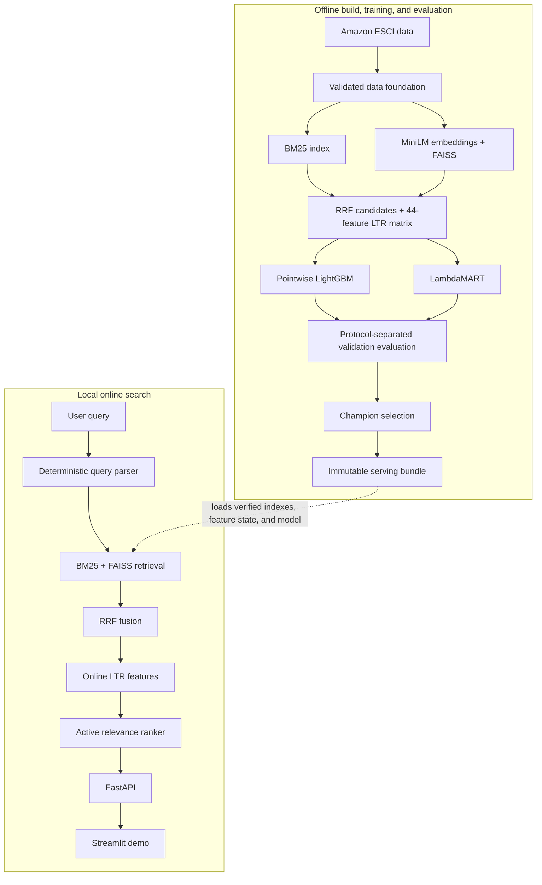

# MarketRank

**A CPU-first, multi-stage e-commerce search and learning-to-rank system built on the
[Amazon ESCI Shopping Queries Dataset](https://github.com/amazon-science/esci-data).**

MarketRank is an end-to-end search project: it validates and versions the source data, retrieves
products with lexical and semantic models, learns a final ordering from relevance judgments,
evaluates each stage under explicit protocols, and serves the resulting system through a local API
and interactive demo.

The project is designed to run on an Apple M3 Mac with 8 GB of unified memory. Expensive workflows
are isolated into resumable offline stages; application startup only loads verified, immutable
artifacts.

> **Status:** The core project is complete through Goldfish 016A. The frozen portfolio release,
> passing M3/8 GB qualification, clean reproduction evidence, and validated demo screenshots were
> produced from revision `e5455991a1f5c417f828a4195b3371df0526afd5` under configuration
> `4f8ee4896cfefa049c910e9f47d58fb61619084cad60ec0fc29a86141b891838`.

## Frozen portfolio results

The final release evaluates 6,028 untouched project-test queries. LambdaMART was selected using
validation only and was carried unchanged into the frozen test evaluation.

| Measurement | Final result |
|---|---:|
| LambdaMART closed-pool NDCG@10 | 0.7272 (95% CI 0.7221–0.7327) |
| LambdaMART closed-pool NDCG@20 | 0.8101 (95% CI 0.8057–0.8142) |
| Hybrid catalog judged recall@10 | 0.3025 (95% CI 0.2949–0.3108) |
| Hybrid catalog judged recall@100 | 0.6171 (95% CI 0.6094–0.6254) |
| Active-serving p95 latency | 167.0 ms |
| Cold startup | 19.0 s |
| Peak resident memory | 2.46 GB against a 5.91 GB ceiling |
| Clean reproduction | 272 tests passed |

On the complete judged pool, LambdaMART improved NDCG@10 over RRF by 0.0088 (95% CI
0.0065–0.0112) and over the pointwise model by 0.0045 (95% CI 0.0019–0.0072). The end-to-end
diagnostics are less uniformly positive: compared with RRF, LambdaMART reduced top-10 exact hit,
judged MRR, judged recall, and known-judgment coverage. This is the project's central tradeoff:
the learned ranker improves ordering when the judged products are present, but it does not repair
limited top-10 retrieval coverage and can move known-relevant products below that cutoff.

These results apply to `esci_task1_us_compact_catalog_v1`, which contains all 340,500 products
judged for portfolio queries plus 100,000 deterministic distractors. They are research-benchmark
measurements, not live Amazon, full-catalog, business, or production-service claims. The generated
artifact DAG and reports are immutable local release outputs and are intentionally excluded from
Git; this README records their exact revision, configuration, scope, and headline results.

## System design



### Search path

1. **Data foundation** — validates the pinned ESCI release, freezes leakage-safe query groups, and
   constructs canonical queries, products, judgments, and product documents.
2. **Candidate retrieval** — combines a persisted BM25 index with normalized MiniLM embeddings and
   exact FAISS inner-product search.
3. **Fusion and features** — merges candidates using deterministic reciprocal-rank fusion and
   computes the ordered `ltr_core_v1` feature set with offline/online parity checks.
4. **Learning to rank** — trains directly comparable pointwise LightGBM and LambdaMART models on
   identical grouped populations.
5. **Selection and serving** — selects one active relevance stage using validation only, packages
   its complete lineage, and serves bounded searches through FastAPI and Streamlit.

## Engineering highlights

- **Reproducible artifact DAG:** every promoted stage is immutable, checksummed, config-hashed, and
  recursively tied to exact parent manifests.
- **Protocol-safe evaluation:** retrieval and closed-pool ranking metrics remain separate so
  unjudged catalog products are never silently treated as irrelevant.
- **Leakage-resistant selection:** complete normalized-query groups define the splits; model and
  champion selection use validation only, while project test stays frozen until finalization.
- **Resource-aware execution:** checkpointed product embedding, partitioned feature/evaluation
  artifacts, and separate processes keep required workflows within an M3/8 GB design envelope.
- **Offline runtime:** after explicit data and model acquisition, training, evaluation, serving,
  and the demo require no network access.
- **Graceful degradation:** serving can fall back from a learned ranker to RRF or from one retriever
  to the other without rebuilding artifacts at request time.

## Dataset and benchmark

MarketRank uses official ESCI Task 1 relevance judgments for the US locale with
`small_version == 1`. The default portfolio benchmark is a deterministic compact catalog that
contains every product judged for a portfolio query plus 100,000 label-blind, SHA-256-selected
distractors.

The compact catalog makes full local experimentation practical, but it is not Amazon's production
catalog and must not be described as full-catalog performance. ESCI relevance judgments are the
only supervised targets; the project does not invent price, inventory, conversion, seller, or
other marketplace signals.

### Evaluation boundaries

| Protocol | Population | Valid measures |
|---|---|---|
| Retrieval | Fixed compact catalog | Judged recall, exact hit, judged MRR, known-judgment coverage, unjudged rate |
| Closed-pool ranking | Complete judged product set per query | Official-gain NDCG, precision, MAP, MRR, exact hit |
| End-to-end diagnostic | Retrieved hybrid candidate union | Qrels-aware retrieval diagnostics; no naive catalog NDCG |

Query-level bootstrap intervals, slices, ablations, failure analysis, and exact experiment lineage
are persisted with the evaluation artifacts. Final test scoring occurs once per named release
generation and does not trigger retuning.

## Technology

| Area | Stack |
|---|---|
| Data and contracts | Python 3.11, Polars, Pydantic, Parquet |
| Sparse retrieval | Deterministic tokenization, persisted BM25 |
| Dense retrieval | Sentence Transformers, MiniLM, NumPy memmaps, FAISS CPU |
| Ranking | LightGBM pointwise regression and LambdaMART |
| Evaluation | Grouped metrics, bootstrap confidence intervals, protocol-specific reports |
| Serving and demo | FastAPI, Uvicorn, Streamlit |
| Quality | uv, Ruff, strict mypy, pytest, pre-commit |

## Quick start

The required local environment is macOS, Python 3.11, and the OpenMP runtime used by LightGBM.

```bash
brew install python@3.11 uv libomp
uv sync --frozen --group dev --python 3.11
```

Run the quality gates:

```bash
uv lock --check
uv run ruff format --check .
uv run ruff check .
uv run mypy src tests
uv run pytest
```

Data and pretrained model downloads are intentionally explicit. To build the complete portfolio
lineage, follow the [final release runbook](docs/runbooks/final-portfolio-release.md).

### Run an existing serving bundle

```bash
uv run market-rank serving run --bundle-id \
  serving-bundle/<dataset-version>/portfolio/serving-bundle-v1/<config-sha256>
```

In another terminal:

```bash
uv run market-rank demo check
uv run market-rank demo run
```

The API listens on `http://127.0.0.1:8000` and the demo on `http://127.0.0.1:8501`. Both are
loopback-only by default.

## Repository structure

```text
ecommerce_market_ranker/
├── configs/                 # Typed, versioned runtime configuration
├── docs/goldfish/           # Component design and acceptance records
├── docs/runbooks/           # Qualification and final-release procedures
├── src/market_rank/
│   ├── data/                # Acquisition, validation, splits, foundation
│   ├── retrieval/           # BM25, MiniLM/FAISS, RRF
│   ├── features/            # Query understanding and LTR features
│   ├── ranking/             # Training populations and LightGBM models
│   ├── evaluation/          # Retrieval and ranking protocols
│   ├── serving/             # Immutable bundle, orchestration, FastAPI
│   └── demo/                # API-backed Streamlit client
└── tests/                   # Unit, integration, and smoke coverage
```

## Documentation

- [Technical design document](ELEPHANT.md) — authoritative end-state architecture and decisions
- [Consolidated roadmap](docs/goldfish/consolidated-roadmap.md) — implemented Goldfish sequence and
  optional extensions
- [Final portfolio release runbook](docs/runbooks/final-portfolio-release.md) — frozen build,
  evidence capture, and test finalization
- [Local qualification runbook](docs/runbooks/local-release-qualification.md) — M3/8 GB latency,
  readiness, and resource gates
- [`configs/base.yaml`](configs/base.yaml) — canonical runtime configuration

## Limitations

- The benchmark is based on ESCI judgments, not live behavioral or business outcomes.
- Unjudged retrieved products have unknown relevance; they are not presumed irrelevant.
- The compact catalog is designed for local experimentation and is not an Amazon-scale claim.
- The required system is CPU-first and local; it is not a distributed production search service.
- Diversity and neural reranking are optional extensions and are not part of the core champion.

## License

Apache-2.0.
